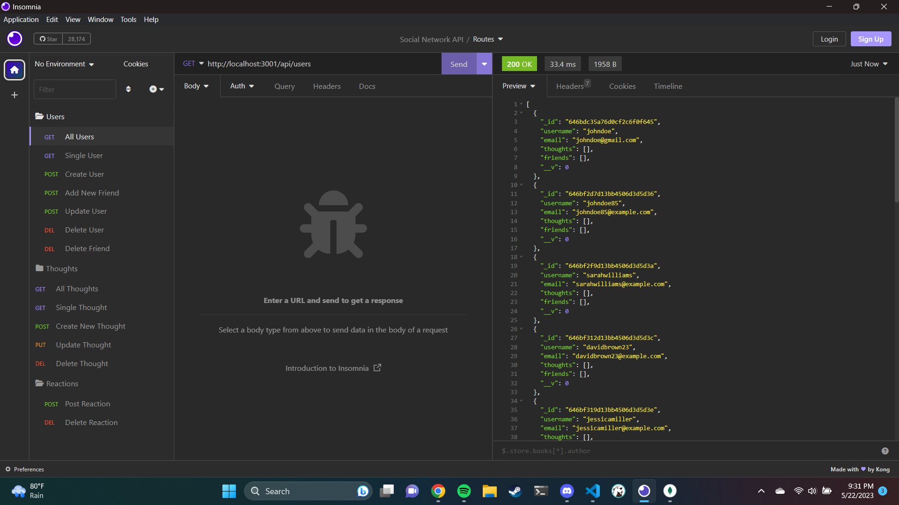
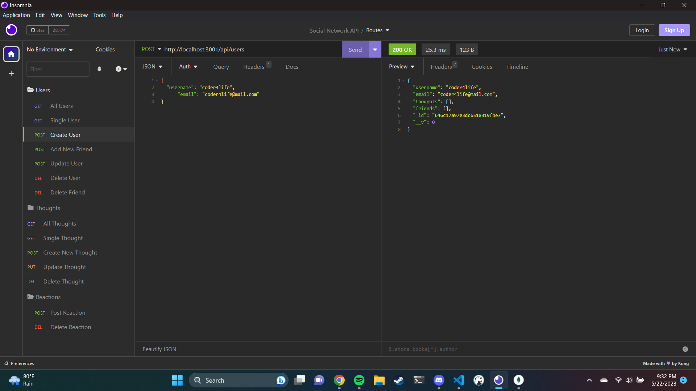

# Social-Network-API
An API where users can connect with friends and strangers through posts, comments, and reactions.

For a video demonstration [click here](https://drive.google.com/file/d/1Ny2EC9113AbWfKGiiTN_u4cSBWB8np7e/view).

## Table of Contents

[Description](#description)

[Installation](#Installation)

[Usage](#Usage)

[Screenshots](#screenshots)

[Technologies-Used](#technologies-used)

[Credits](#credits)

[Questions](#questions)

## Description

This social networking API allows users to create, update, and delete thought posts as well as react to thoughts posted by other users. Users can also add and delete friends. When a user deletes their account, their associated posts are also deleted.

## Installation

To run this API locally:

1. Clone the repository to your local machine.

2. Make sure to install the packages from the package.json.

3. Open the development platform of your choice and test the routes.

## Usage

Open the development platform of your choice and test the routes. Seeds are not provided in this code so you will need to create your own.

## Screenshots

## Technologies Used

* Node.js
* Express.js
* MongoDB
* Mongoose

## Credits

mod7ex on Stack Overflow for the date timestamp code snippet, AskBSC Learning Assistants, and my classmates!

## License

[Click here](https://opensource.org/licenses/MIT) for more information on the license used.

## Questions

[Click Here](https://github.com/emilymclean94) to view my GitHub profile.